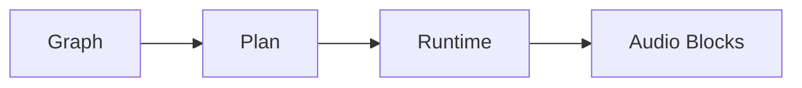

[](https://crates.io/crates/auxide)
[](https://docs.rs/auxide)
[](https://github.com/Michael-A-Kuykendall/auxide/actions)
[](https://opensource.org/licenses/MIT)

# Auxide

**A real-time-safe, deterministic audio graph kernel for Rust.**  
Build reliable audio tools, DSP chains, and synthesis engines with a focus on correctness, performance, and simplicity.

## What is Auxide?

Auxide fills a gap in the Rust audio ecosystem: a low-level, RT-safe kernel for executing audio graphs deterministically. Unlike full DAWs or plugin hosts, it's a programmable building block—think of it as the engine under the hood.

### The Audio Graph Paradigm
Audio processing as a **directed acyclic graph (DAG)**:
- **Nodes**: DSP units (oscillators, filters, effects).
- **Edges**: Signal flow between nodes.
- **Execution**: Topological order ensures no feedback loops.

This model powers everything from modular synths to game audio engines.

### Why Auxide? Why Now?
Existing options are either:
- **Too high-level**: DAWs like Reaper or Ableton—great for artists, not for code.
- **Too niche**: SuperCollider's dense, functional style alienates engineers.
- **Unsafe**: Many Rust audio libs sacrifice RT safety for ease.

Auxide is **engineer-friendly**: Minimal API, zero-cost abstractions, RT-safe by default. It's designed for software developers building audio tools, not musicians coding live.

| Feature          | Auxide | SuperCollider | Rodio | CPAL |
|------------------|--------|---------------|-------|-----|
| RT-Safe         | ✅    | ❌            | ❌   | ✅  |
| Graph-Based     | ✅    | ✅            | ❌   | ❌  |
| Deterministic   | ✅    | ❌            | ❌   | ❌  |
| Minimal API     | ✅    | ❌            | ✅   | ✅  |
| Rust Native     | ✅    | ❌            | ✅   | ✅  |

## Governance

Auxide is open source but not open contribution. The project is maintained by @Michael-A-Kuykendall; unsolicited PRs are closed by default. See CONTRIBUTING.md and GOVERNANCE.md for the collaboration policy.

## Architecture

Auxide's three-phase pipeline ensures reliability:

1. **Graph Building**: Construct your DAG with nodes and edges.
2. **Plan Compilation**: Validate invariants, optimize for execution.
3. **Runtime Execution**: Process audio blocks deterministically.



### Key Invariants
- **Single-writer**: One edge per input port.
- **No cycles**: Acyclic graphs only.
- **Rate compatibility**: Audio/Control rates match.
- **Determinism**: Same inputs → same outputs.

### Extending with External Nodes (0.2)
- Implement the `NodeDef` trait in your crate, then register via `Graph::add_external_node(...)`.
- Ports are declared as static slices; no allocations or locks are allowed in `process_block`.
- The core `NodeType` variants remain unchanged; the hook is additive and RT-safe.

Violations caught at compile-time or runtime with clear errors.

## Quick Start

Install: `cargo add auxide`

Generate a sine wave:

```rust
use auxide::graph::{Graph, NodeType, PortId, Rate};
use auxide::plan::Plan;
use auxide::rt::Runtime;

fn main() {
    // Build graph
    let mut graph = Graph::new();
    let osc = graph.add_node(NodeType::SineOsc { freq: 440.0 });
    let sink = graph.add_node(NodeType::OutputSink);
    graph.add_edge(auxide::graph::Edge {
        from_node: osc,
        from_port: PortId(0),
        to_node: sink,
        to_port: PortId(0),
        rate: Rate::Audio,
    }).unwrap();

    // Compile plan
    let plan = Plan::compile(&graph, 64).unwrap();

    // Run runtime
    let mut runtime = Runtime::new(plan, &graph, 44100.0);
    let mut out = vec![0.0; 64];
    runtime.process_block(&mut out).unwrap();

    println!("Generated {} samples of 440Hz sine", out.len());
}
```

Run this and hear a pure tone—your first Auxide audio!

## Advanced Examples

### Fan-Out and Mixing
Route one signal to multiple processors, then mix back:

```rust
use auxide::graph::{Graph, NodeType, PortId, Rate};
use auxide::plan::Plan;
use auxide::rt::Runtime;

fn main() {
    let mut graph = Graph::new();
    let osc = graph.add_node(NodeType::SineOsc { freq: 440.0 });
    let gain1 = graph.add_node(NodeType::Gain { gain: 0.5 });
    let gain2 = graph.add_node(NodeType::Gain { gain: 0.3 });
    let mixer = graph.add_node(NodeType::Mix);
    let sink = graph.add_node(NodeType::OutputSink);

    // Fan out: osc feeds both gains
    graph.add_edge(auxide::graph::Edge {
        from_node: osc,
        from_port: PortId(0),
        to_node: gain1,
        to_port: PortId(0),
        rate: Rate::Audio,
    }).unwrap();
    graph.add_edge(auxide::graph::Edge {
        from_node: osc,
        from_port: PortId(0),
        to_node: gain2,
        to_port: PortId(0),
        rate: Rate::Audio,
    }).unwrap();

    // Mix attenuated signals
    graph.add_edge(auxide::graph::Edge {
        from_node: gain1,
        from_port: PortId(0),
        to_node: mixer,
        to_port: PortId(0),
        rate: Rate::Audio,
    }).unwrap();
    graph.add_edge(auxide::graph::Edge {
        from_node: gain2,
        from_port: PortId(0),
        to_node: mixer,
        to_port: PortId(1),
        rate: Rate::Audio,
    }).unwrap();
    graph.add_edge(auxide::graph::Edge {
        from_node: mixer,
        from_port: PortId(0),
        to_node: sink,
        to_port: PortId(0),
        rate: Rate::Audio,
    }).unwrap();

    let plan = Plan::compile(&graph, 64).unwrap();
    let mut runtime = Runtime::new(plan, &graph, 44100.0);
    let mut out = vec![0.0; 64];
    runtime.process_block(&mut out).unwrap();

    // out now contains mixed, attenuated sine
}
```

This demonstrates **parallel processing** and **signal combination**—core to audio graphs.

### Offline Rendering
Process entire buffers for non-real-time tasks:

```rust
use auxide::graph::{Graph, NodeType, PortId, Rate};
use auxide::plan::Plan;
use auxide::rt::Runtime;

fn main() {
    let mut graph = Graph::new();
    let osc = graph.add_node(NodeType::SineOsc { freq: 1000.0 });
    let sink = graph.add_node(NodeType::OutputSink);
    graph.add_edge(auxide::graph::Edge {
        from_node: osc,
        from_port: PortId(0),
        to_node: sink,
        to_port: PortId(0),
        rate: Rate::Audio,
    }).unwrap();

    let plan = Plan::compile(&graph, 1024).unwrap();
    let mut runtime = Runtime::new(plan, &graph, 44100.0);

    // Render 1 second of audio
    let mut buffer = vec![0.0; 44100];
    for chunk in buffer.chunks_mut(1024) {
        runtime.process_block(chunk).unwrap();
    }

    // buffer now holds 1s of 1kHz sine
    // Save to WAV, analyze, etc.
}
```

Perfect for batch processing, analysis, or exporting.

### More Examples
Check `examples/` for:
- `basic_sine.rs`: Simple oscillator.
- `gain_chain.rs`: Signal processing chain.
- `mixer.rs`: Multi-input mixing.
- `offline_render.rs`: Full buffer rendering.
- `am_synth.rs`: Amplitude modulation demo.
- `filter_chain.rs`: Basic filter approximation.
- `sequencer.rs`: Note sequencing.

Clone the repo and run `cargo run --example <name>` to explore.

## Usage Patterns

### Building a Synth
Extend `NodeType` with custom oscillators, filters. Use Auxide for the graph engine.

### Game Audio
Dynamic graphs for sound design—RT-safe for frame rates.

### Prototyping DSP
Quickly test ideas without RT constraints.

### Integration
Pair with `cpal` for playback, `hound` for file I/O.

**Recommended**: Use [auxide-io](https://github.com/Michael-A-Kuykendall/auxide-io) for turnkey audio output with RT-safe streaming.

## Audio I/O with Auxide IO

Auxide handles the DSP graph—**Auxide IO** handles the hardware. For real-time audio playback, use [auxide-io](https://github.com/Michael-A-Kuykendall/auxide-io), the official I/O companion crate.

**Features:**
- **CPAL Integration**: Cross-platform audio output
- **Buffer Adaptation**: Handles size mismatches between Auxide blocks and host buffers
- **Channel Routing**: Mono-to-stereo conversion
- **RT-Safe**: Atomic state management, no allocations in callbacks
- **Error Recovery**: Graceful failure with silence

**Quick Start with Audio Output:**
```rust
use auxide::graph::{Graph, NodeType, PortId, Rate};
use auxide::plan::Plan;
use auxide::rt::Runtime;
use auxide_io::StreamController;

fn main() -> anyhow::Result<()> {
    // Build sine wave graph (same as before)
    let mut graph = Graph::new();
    let osc = graph.add_node(NodeType::SineOsc { freq: 440.0 });
    let sink = graph.add_node(NodeType::OutputSink);
    graph.add_edge(auxide::graph::Edge {
        from_node: osc,
        from_port: PortId(0),
        to_node: sink,
        to_port: PortId(0),
        rate: Rate::Audio,
    })?;

    let plan = Plan::compile(&graph, 512)?;
    let runtime = Runtime::new(plan, &graph, 44100.0);

    // Stream to speakers!
    let controller = StreamController::play(runtime)?;
    controller.start()?;
    // Audio plays... press Enter to stop
    std::io::stdin().read_line(&mut String::new())?;
    controller.stop();

    Ok(())
}
```

Add to `Cargo.toml`:
```toml
[dependencies]
auxide = "0.1"
auxide-io = "0.1"
```

**🔗 [Get Auxide IO](https://github.com/Michael-A-Kuykendall/auxide-io) | [Crate](https://crates.io/crates/auxide-io) | [Docs](https://docs.rs/auxide-io)**

## Key Features

- **RT-Safe**: No allocs/locks in hot paths.
- **Deterministic**: Reproducible output.
- **Minimal**: Small API surface, easy to learn.
- **Extensible**: Add nodes via traits.
- **Tested**: Fuzzing, property tests, benchmarks.
- **Performant**: Low-latency block processing (benchmarks show stable timing under load).

## Non-Goals

- GUI or DAW features.
- Plugin formats (VST, etc.).
- Live coding environments.
- Multichannel beyond mono.
- OS audio backends.

Auxide is the foundation—build your tools on top.

## Roadmap

- v0.2: More built-in nodes, stereo support.
- v1.0: Stable API, performance optimizations.

## Contributing

Issues and PRs welcome. See [CONTRIBUTING.md](CONTRIBUTING.md) for guidelines.

## Sponsorship

🚀 **If Auxide helps you, consider [sponsoring](https://github.com/sponsors/Michael-A-Kuykendall) — 100% of support goes to keeping it free forever.**

- **$5/month**: Coffee tier ☕ - Eternal gratitude + sponsor badge
- **$25/month**: Bug prioritizer 🐛 - Priority support + name in [SPONSORS.md](SPONSORS.md)
- **$100/month**: Corporate backer 🏢 - Logo placement + monthly office hours
- **$500/month**: Infrastructure partner 🚀 - Direct support + roadmap input

[**🎯 Become a Sponsor**](https://github.com/sponsors/Michael-A-Kuykendall) | See our amazing [sponsors](SPONSORS.md) 🙏

## License

MIT