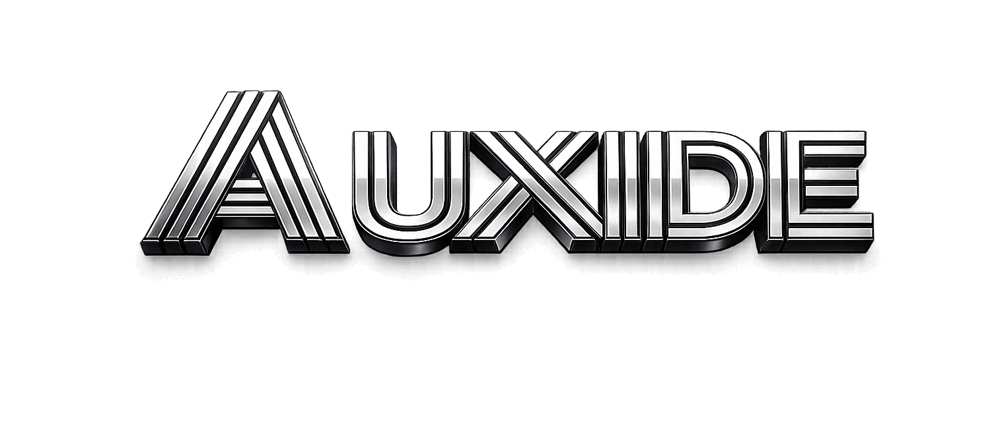

  

  # The RT-Safe Audio Graph Kernel for Rust

  ### Deterministic. Minimal. Real-Time Safe.

  
  
  
  

  

**Auxide will be free forever.** No asterisks. No "free for now." No pivot to paid.

### 💝 Support Auxide's Growth

🚀 **If Auxide helps you build amazing audio tools, consider [sponsoring](https://github.com/sponsors/Michael-A-Kuykendall) — 100% of support goes to keeping it free forever.**

- **$5/month**: Coffee tier ☕ — Eternal gratitude + sponsor badge
- **$25/month**: Bug prioritizer 🐛 — Priority support + name in [SPONSORS.md](SPONSORS.md)
- **$100/month**: Corporate backer 🏢 — Logo placement + monthly office hours
- **$500/month**: Infrastructure partner 🚀 — Direct support + roadmap input

[**🎯 Become a Sponsor**](https://github.com/sponsors/Michael-A-Kuykendall) | See our amazing [sponsors](SPONSORS.md) 🙏

---

## Table of Contents

- [What Is Auxide?](#what-is-auxide)
- [Auxide Ecosystem](#auxide-ecosystem)
- [Documentation](#documentation)
- [License](#license)

---

## What Is Auxide?

Auxide is a low-level, RT-safe kernel for executing audio graphs deterministically. Unlike full DAWs or plugin hosts, it's a programmable building block — think of it as the engine under the hood.

Audio processing as a **directed acyclic graph (DAG)**:
- **Nodes**: DSP units (oscillators, filters, effects).
- **Edges**: Signal flow between nodes.
- **Execution**: Topological order ensures no feedback loops.

| Feature | Auxide | SuperCollider | Rodio | CPAL |
|---------|--------|---------------|-------|------|
| RT-Safe | ✅ | ❌ | ❌ | ✅ |
| Graph-Based | ✅ | ✅ | ❌ | ❌ |
| Deterministic | ✅ | ❌ | ❌ | ❌ |
| Minimal API | ✅ | ❌ | ✅ | ✅ |
| Rust Native | ✅ | ❌ | ✅ | ✅ |

---

## Auxide Ecosystem

Auxide is an ecosystem of crates:

| Crate | Description | Version |
|-------|-------------|---------|
| **[auxide](https://github.com/Michael-A-Kuykendall/auxide)** | Real-time-safe audio graph kernel | 0.3.2 |
| [auxide-dsp](https://github.com/Michael-A-Kuykendall/auxide-dsp) | DSP nodes library | 0.2.1 |
| [auxide-io](https://github.com/Michael-A-Kuykendall/auxide-io) | Audio I/O layer | 0.1.3 |
| [auxide-midi](https://github.com/Michael-A-Kuykendall/auxide-midi) | MIDI integration | 0.1.2 |

---

## Documentation

- **[Quick Start](docs/QUICK_START.md)** — build your first audio graph.
- **[Advanced Examples](docs/ADVANCED_EXAMPLES.md)** — fan-out mixing, offline rendering, DSP integration.
- **[Architecture](docs/ARCHITECTURE.md)** — graph building, plan compilation, runtime execution, key invariants.
- **[Roadmap](ROADMAP.md)** — version history and future plans.
- **[Contributing](CONTRIBUTING.md)** — collaboration policy.

---

## License

MIT
